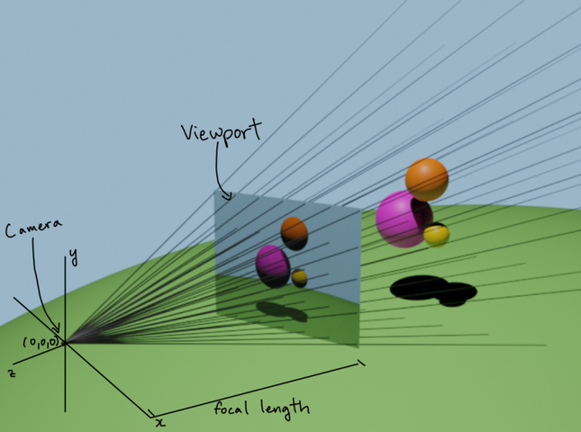
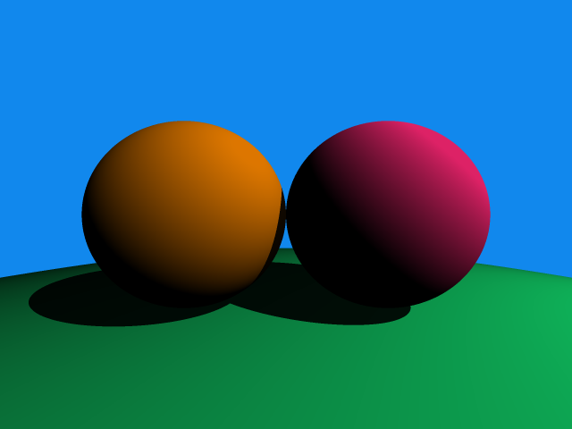

# 🌌 Ray Tracing Renderer (C)

A lightweight **CPU-based Ray Tracing Renderer** written in **C**, built as part of a university graphics programming course.  
The project demonstrates the fundamentals of **computer graphics**, including vectors, rays, lighting, shading, and anti-aliasing — all implemented from scratch without external graphics libraries.

---

## 🧭 Concept Overview

Ray tracing simulates how light interacts with objects by tracing rays from a virtual **camera** through a **viewport** into a 3D scene.  
Each ray checks for intersections with scene geometry (e.g., spheres), determines lighting and shading at the hit point, and outputs a pixel color.

<p align="center">
   
</p>

---

## 🧩 Features

- Implements **ray–sphere intersection detection** and **diffuse (Lambertian) lighting**
- Supports **shadow rendering** from one or more light sources
- Includes **anti-aliasing** via multi-sample pixel averaging
- Modular structure with **vector**, **color**, and **geometry** components
- Renders final images in **PPM format** for easy viewing and debugging

---

## 🧠 Technologies Used

- **Language:** C  
- **Concepts:** Ray tracing, linear algebra, shading models, anti-aliasing  
- **Tools:** GCC / Clang, Makefile for build automation  

---

## 👤 My Contribution

- Implemented the **vector math library** and **ray–sphere intersection** logic  
- Added **lighting and shadow calculations** using Lambertian reflection  
- Developed **anti-aliasing** through stochastic pixel sampling  
- Integrated all modules into a working ray tracer that generates `.ppm` image outputs  

---

## 🎨 Rendered Output

<p align="center">
  
</p>

The image above demonstrates ray–sphere intersections, diffuse shading, and shadow rendering using a single light source.

---

## ⚙️ Build & Run

### Requirements
- **C Compiler** (GCC or Clang)
- **Make** (optional but recommended)

### Build
```bash
make
